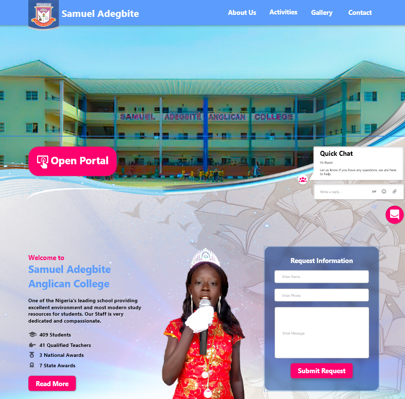
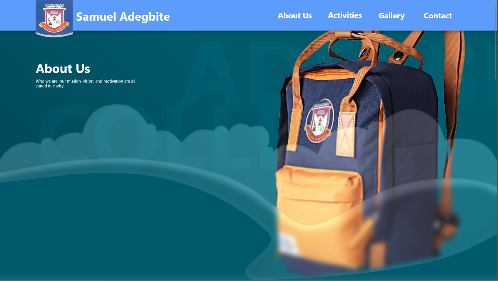
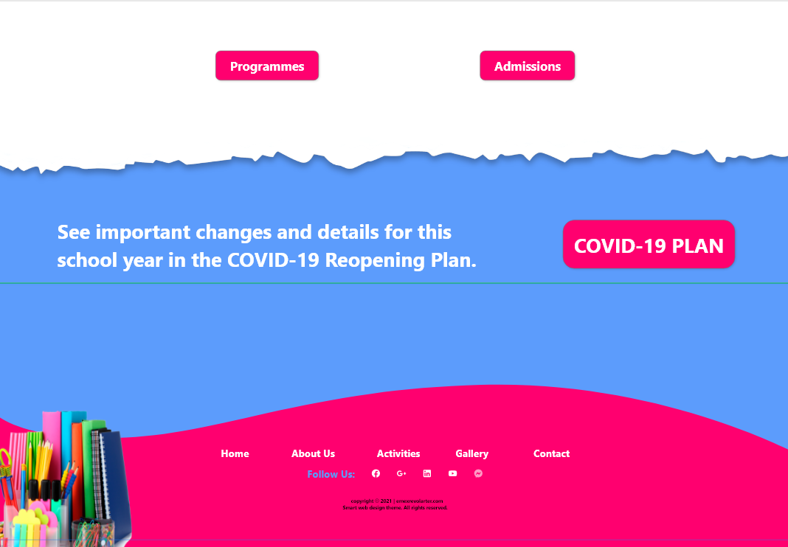
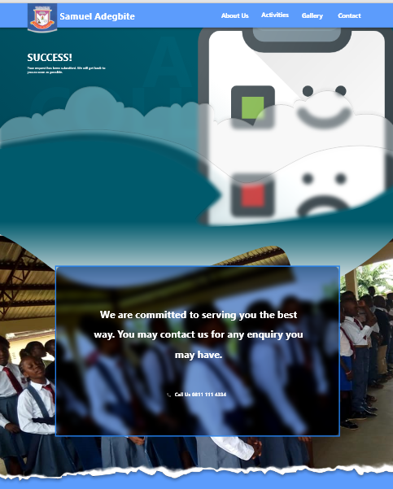
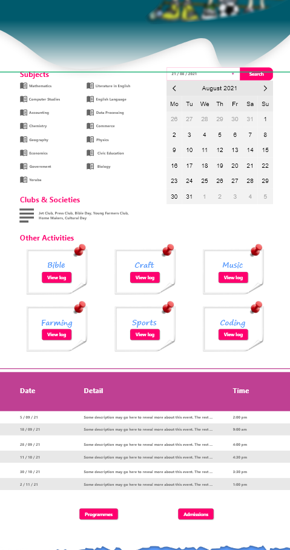
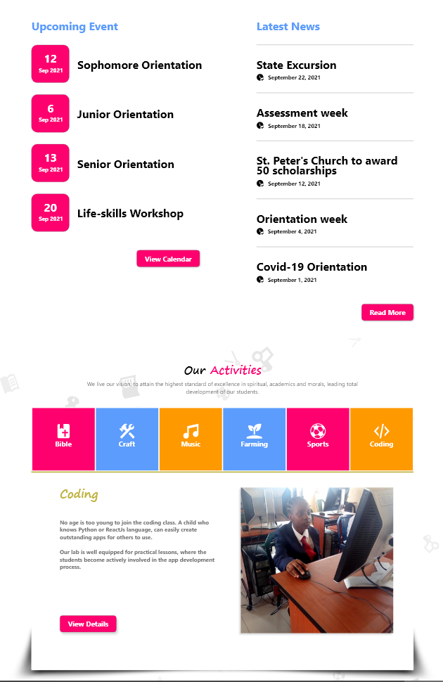

# AdobeXD School Web

Web UI for secondary school with 26 pages, including sample images and texts. Prototype links are included, which gives it a demo capability.

# App Overview

[Download XD file][1]

## View Demo Videos

[App Demo][2] | [Assets Demo][3] | [Prototype Demo][4]

# Included Pages

home

Header & Hero

Footer

Contact Us

Feedback

Activities

Events

News

Coming Soon

# Creation Date

* 21st August, 2021

Do visit our website: [https://emexrevolarter.com](https://emexrevolarter.com) for more information on web & mobile solutions.

Thank you for visiting. If you found this repository helpful, please do star it.

  [1]: xd_samuel_adegbite.xd
  [2]: assets/videos/xd%20samuel%20adegbite.mp4
  [3]: assets/videos/assets.mp4
  [4]: assets/videos/prototype%20overview.mp4
